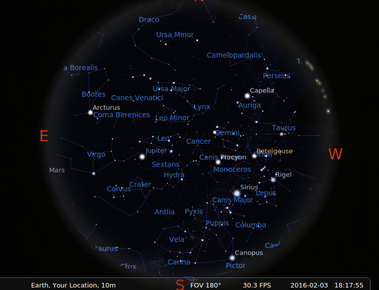

---

## About the App

This presentation is derived from this project I developed at HackRice 2016 <http://devpost.com/software/spacecraft-spotter>.<sup>1</sup>

Today we discuss a subset of this app which asks for a user's location and displays an image of the sky with constellations from that place.

<sup>1</sup>__Important:__ This is the product of a hackathon from first timers, so the code and practices are not the best ones. Look at the other submissions too.

## Stellarium

[Stellarium](http://www.stellarium.org/) is a free astronomy software for all operating systems.



We use [Stellarium's scripting engine](http://www.stellarium.org/doc/head/scripting.html) to set latitude and longitude without human intervention

## Stellarium script

`test.ssc`
```
core.setRealTime();
core.setObserverLocation(-20, 50, 10, 0, "Somewhere");
StelMovementMgr.zoomTo(180, 0);
core.wait(1);
core.screenshot("skyshot");
core.wait(1);
core.quitStellarium();
```

Run as:

`stellarium --screenshot-dir "$PWD" --startup-script "$PWD/test.ssc"`

Should produce `skyshot000.png`

## Write a shell script to set location (1)

Create an input template:

```
core.setRealTime();
core.setObserverLocation(LON, LAT, 10, 0, "Your Location");
StelMovementMgr.zoomTo(180, 0);
core.wait(1);
core.screenshot("skyshot");
core.wait(1);
core.quitStellarium();
```

LON and LAT will be replaced with user specified location.

## Write a shell script to set location (2)

Inputs to our script: Latitude ($1), Longitude ($2)
```{sh}
if [ $# -ne 2 ]
then
	exit;
fi
rm skyshot000.png
cat in.ssc | sed -e "s/LAT/$1/" | sed -e "s/LON/$2/" > final.ssc
cat final.ssc
stellarium --screenshot-dir "$PWD" --startup-script "$PWD/final.ssc" &
sleep 4
pkill stellarium
```

Run as:

`sh run.sh 20 -90`

## NodeJS

- Fast, lightweight, portable (Chrome JS engine)
- JavaScript syntax - familiar language for web developers
- `npm` Node package manager with a huge selection

## NodeJS Express web server

Install __express__ package:

`npm install express`

Web server in 4 lines:

http.js:
```{js}
var express = require('express');
var app = express();

app.use(express.static(__dirname + '/'));
app.listen(8080);
```

## Interface {.smaller}

index.html:
```{html}
<html>
<head>
  <title>Welcome to Sky Imager</title>
</head>

<body>

<h1>Sky Imager</h1>

<form action="getImage" method="get">
Your latitude: <input type="text" name="lat" placeholder="latitude"><br />
Your longitude: <input type="text" name="lon" placeholder="longitude"><br />
<button type="submit">Submit</button>
</form>

</body>
</html>
```

See more about [HTML Forms](http://www.w3schools.com/tags/att_form_method.asp).

## Test the basic Express server

Start the express server

`nodejs http.js`

Open this address in browser:

`localhost:8080`

<hr>

<h1>Sky Imager</h1>

<form action="getImage" method="get">
Your latitude: <input type="text" name="lat" placeholder="latitude"><br />
Your longitude: <input type="text" name="lon" placeholder="longitude"><br />
<button>Submit</button>
</form>

## Add functionality to server

The form sends this query:

`localhost:8080/getImage?lat=20&lon=-80`

We have to add a handler for `getImage`

```{js}
app.get('/getImage', function(req, res){
    res.send('You sent lat = ' + req.query.lat + ' and lon = ' + req.query.lon);
});
```

Should respond with
```
You sent lat = 20 and lon = -80
```

## Final server code {.smaller}

Our server executes `run.sh` with the values provided for `lat` and `lon`

```{js}
var express = require('express');
var app = express();

app.use(express.static(__dirname + '/'));
app.listen(8080);

var exec = require('child_process').exec;

app.get('/getImage', function(req, res){
    var cmd = "sh run.sh " + req.query.lat + " " + req.query.lon;
    console.log(cmd);

    exec(cmd, function(error, stdout, stderr) {
        res.sendFile('skyshot000.png', { root: __dirname })
    });
});

```

The exec() function allows execution of shell commands on the server.
__This opens doors for hackers! Remember, this is a hackathon product! DO NOT DEPLOY to public access without securing this code.__

## Download files

- [index.html](f/index.html)
- [server.js](server.js)
- [run.sh](run.sh)
- [in.ssc](in.ssc)

## Read more

- [Stellarium](http://www.stellarium.org/)
- [HTML Forms](http://www.w3schools.com/tags/att_form_method.asp)
- [Stellarium's scripting engine](http://www.stellarium.org/doc/head/scripting.html)
- [Sample Stellarium scripts](http://bazaar.launchpad.net/~stellarium/stellarium/trunk/view/head:/scripts/supernova.ssc)
- [Express server](http://expressjs.com/en/starter/hello-world.html)
- [NodeJS child process](https://nodejs.org/api/child_process.html)
- [Vulnerabilities](https://en.wikipedia.org/wiki/Code_injection)
